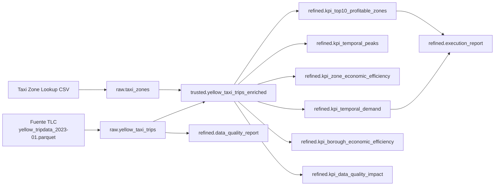

# Linaje de datos

```mermaid
flowchart LR
    A["Fuente TLC<br/>yellow_tripdata_2023-01.parquet"] --> B["raw.yellow_taxi_trips"]
    C["Taxi Zone Lookup CSV"] --> D["raw.taxi_zones"]

    B --> E["trusted.yellow_taxi_trips_enriched"]
    D --> E

    E --> F["refined.kpi_temporal_demand"]
    E --> G["refined.kpi_temporal_peaks"]
    E --> H["refined.kpi_zone_economic_efficiency"]
    E --> I["refined.kpi_top10_profitable_zones"]
    E --> J["refined.kpi_borough_economic_efficiency"]
    B --> K["refined.data_quality_report"]
    E --> L["refined.kpi_data_quality_impact"]
    F --> M["refined.execution_report"]
    I --> M
```
